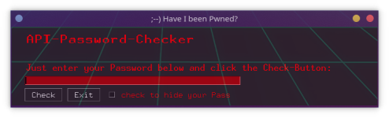

# pwned
Just a small App to check if your passwords has been compromised in a data breach. Its written in python.

Dependencies: hashlib, requests, PySimpleGUI 

Ready to use executables for Linux and Windows in the release section.

Or just clone, install deps with "pip install" and run with "python Pwned.py"
